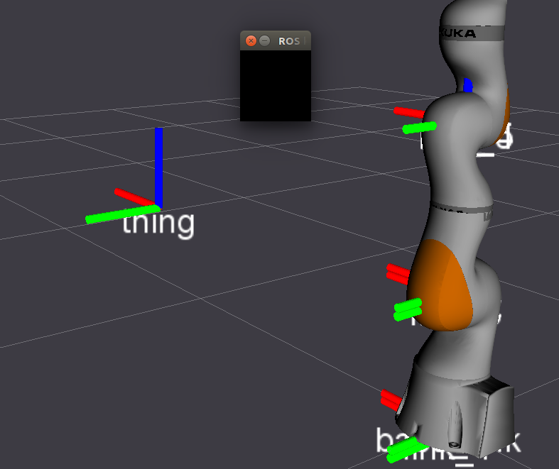

# TF Keyboard Calibration

Move /tf frames around using your keyboard - a simple calibration-by-eye tool!

Developed by Andy McEvoy and [Dave Coleman](http://dav.ee/) at the University of Colorado Boulder

 *  Travis CI
 *  Devel Job Status
 *  AMD64 Debian Job Status

## Usage:

To test, create a new ``/thing`` coordiante from the following demo:

    roslaunch tf_keyboard_cal tf_keyboard_world_to_thing.launch

Start Rviz and use the TF display to visualize its effect.

    roslaunch tf_keyboard_cal rviz_demo.launch

You can now use the keyboard shorcuts below to move the frame around. **NOTE:** Be sure to have the little black window focused on to recieve keyboard input. Once the TF has been positioned, press `p` to save the settings to the config file. The TF will use these new settings when relaunched.

    Manual alignment of camera to world CS:
    =======================================
    MOVE: X  Y  Z  R  P  YAW
    ------------------------
    up    q  w  e  r  t  y
    down  a  s  d  f  g  h
    Fast: u
    Med:  i
    Slow: o
    Save: p

Create a launch file and configuration file similar to the demos in the package's ``config/`` and ``launch/`` folders.
