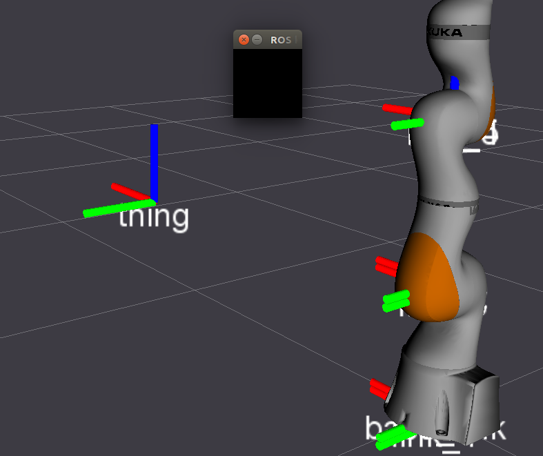
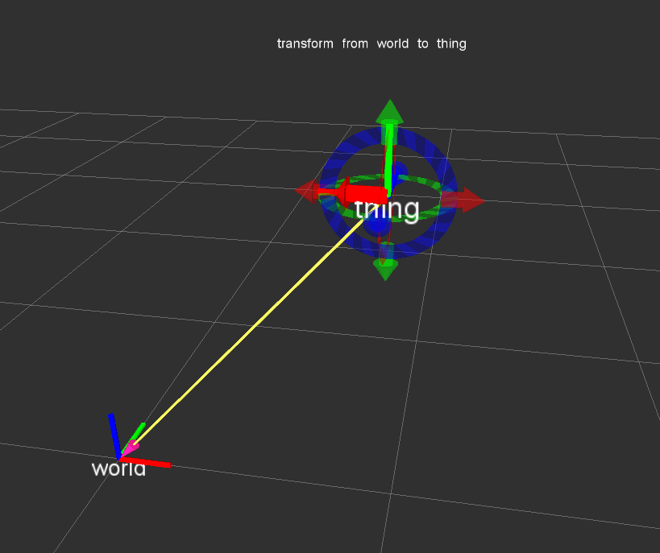

# Manual TF Calibration Tools

Description: Move /tf frames around using your keyboard, an Rviz GUI, or interactive markers - a simple calibration-by-eye tool!

Features:

 - Integrated Rviz panel with multiple calibration approaches

TF Keyboard Calibration developed by Andy McEvoy, [Dave Coleman](http://dav.ee/), and [Sammy Pfeiffer](http://github.com/awesomebytes) at the University of Colorado Boulder, PAL Robotics, MDA US Systems, and PickNik LLC.

Status:

 *  Travis - Continuous Integration
 *  ROS Buildfarm - AMD64 Xenial Debian Build
 *  ROS Buildfarm - AMD64 Xenial Devel Build

Screenshot of calibration using keyboard shortcuts

Screenshot of calibration using interactive markers and the mouse

[Video example](https://www.youtube.com/watch?v=C9BbFv-C9Zo) of interactive marker tf calibration.

## Install

### Ubuntu Debian

> Note: this package has not been released yet

    sudo apt-get install ros-kinetic-tf-manual-cal

### Build from Source

To build this package, ``git clone`` this repo into a [catkin workspace](http://wiki.ros.org/catkin/Tutorials/create_a_workspace) and be sure to install necessary dependencies by running the following command in the root of your catkin workspace:

    rosdep install -y --from-paths src --ignore-src --rosdistro kinetic

## Code API

> Note: this package has not been released yet

See [Class Reference](http://docs.ros.org/kinetic/api/tf_manual_cal/html/)

## Usage of TF Manual Cal:

Start the demo:

    roslaunch tf_keyboard_cal rviz_demo.launch

You can now use the keyboard shorcuts below to move the frame around:

    Manual alignment of camera to world CS:
    =======================================
    MOVE: X  Y  Z  R  P  YAW
    ------------------------
    up    q  w  e  r  t  y
    down  a  s  d  f  g  h
    Fast: u
    Med:  i
    Slow: o
    Save: p

Create a launch file and configuration file similar to the demos in the package's ``config/`` and ``launch/`` folders.

## Demo TF Listener

If you want to get the Eigen or ROS message formatted pose from the interactive marker or keyboard calibration, see the template code:

    src/demo_tf_listener.cpp

## Contribute

Please send PRs for new helper functions, fixes, etc!
